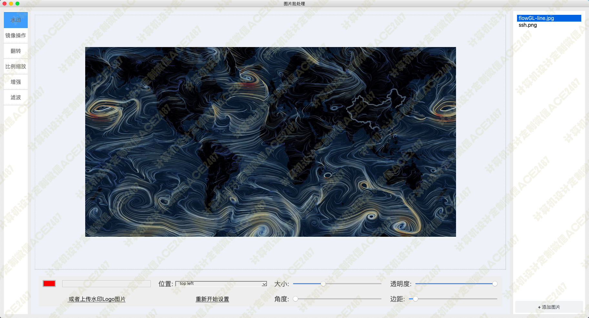
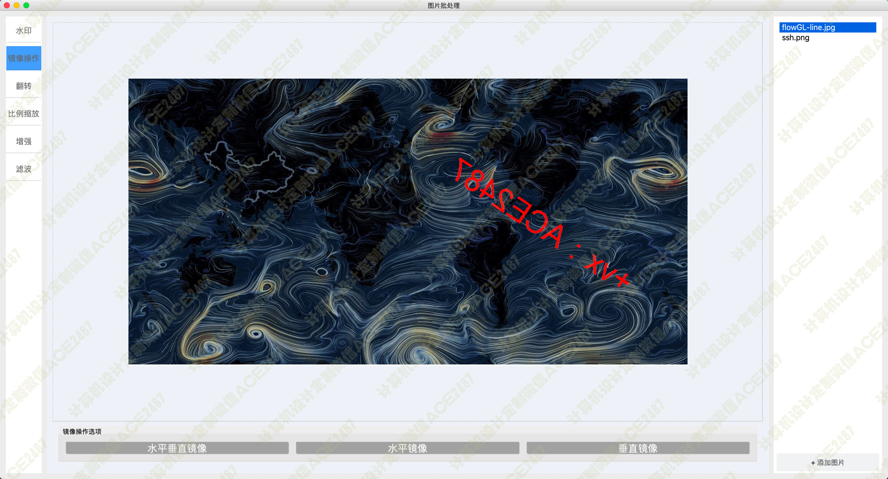
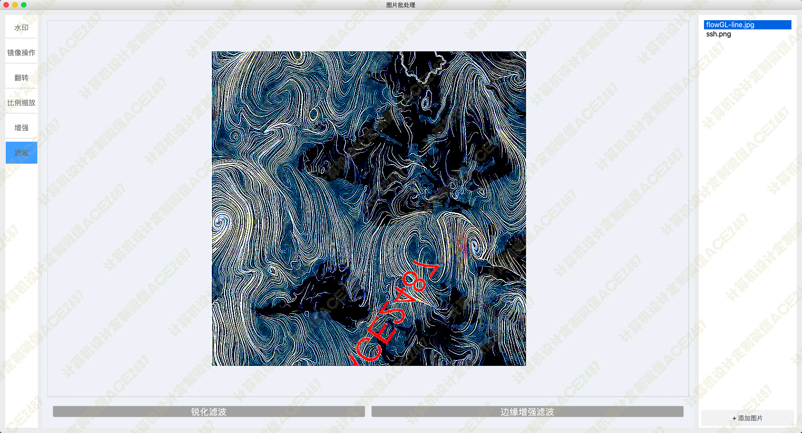
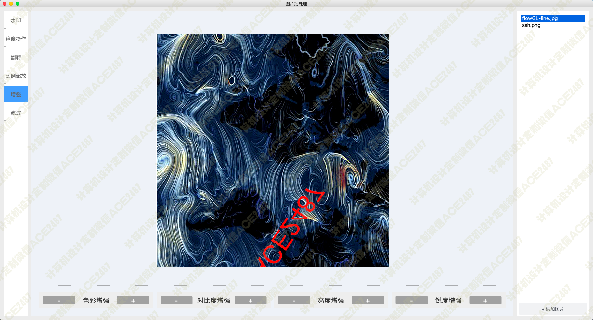
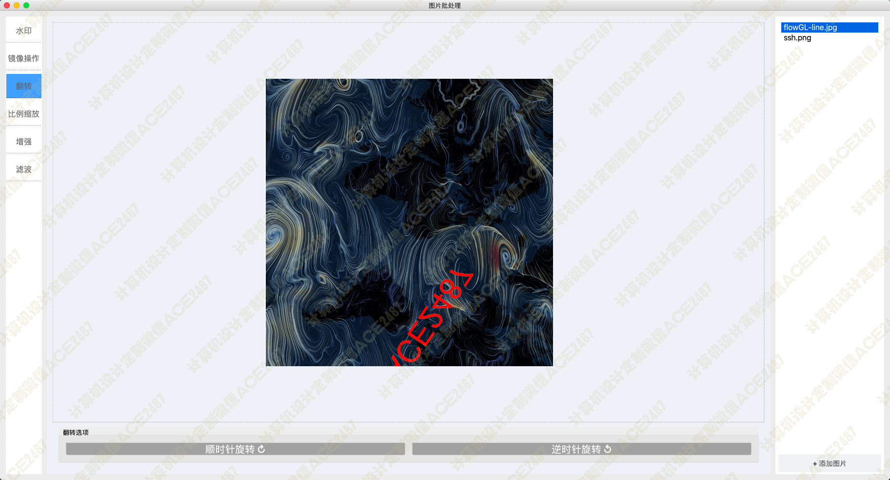
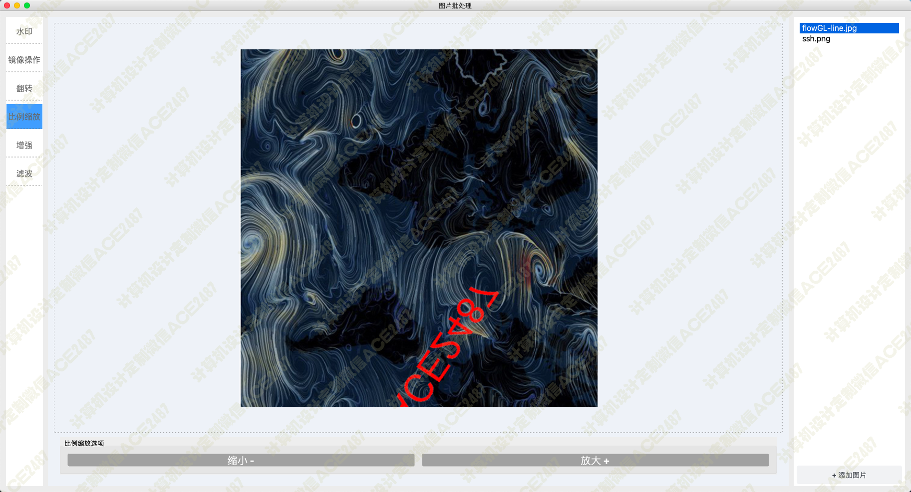
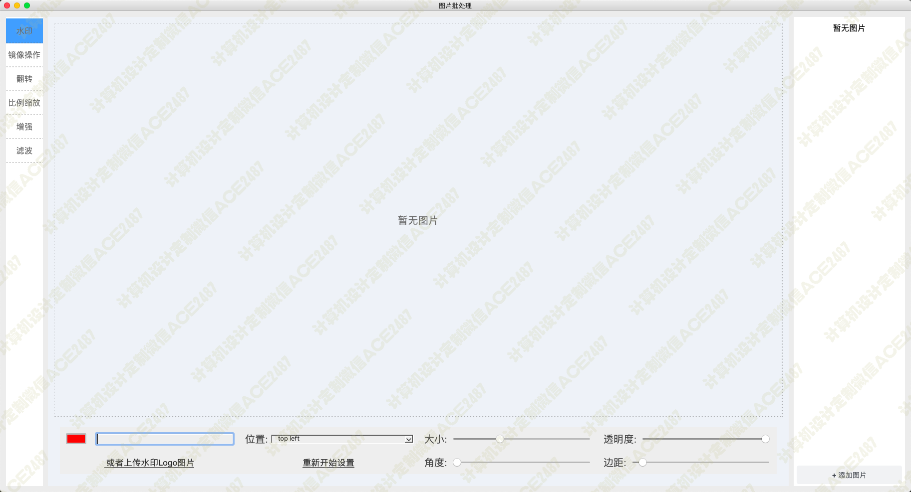
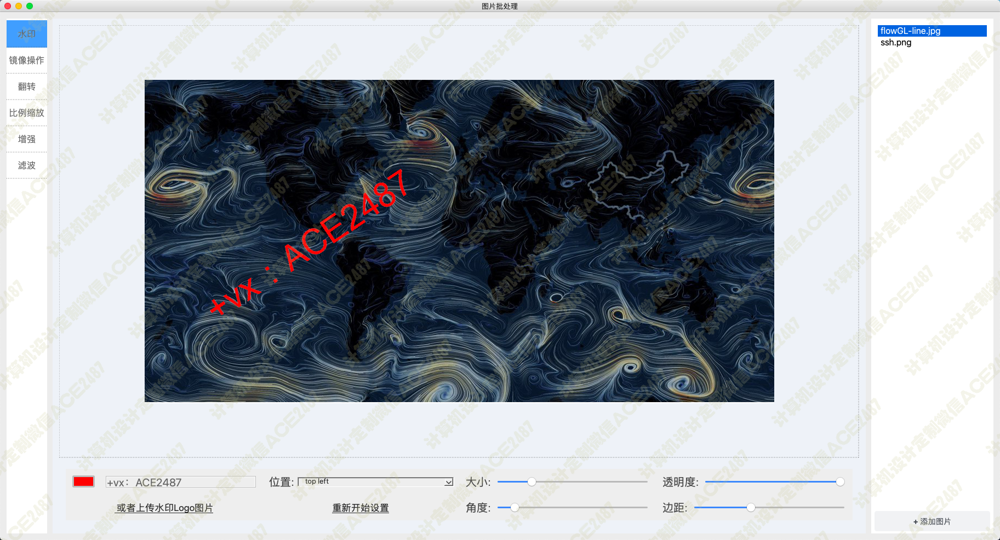
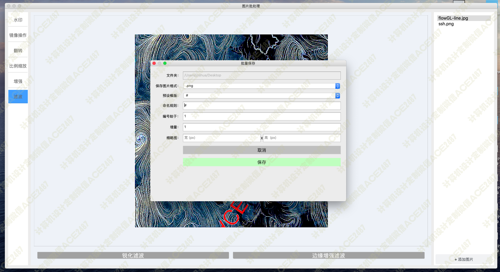

# 016 基于PyQT的图片批处理系统-设计源码展示

> **代码有偿获取 可接受定制 微信联系方式: csbysj2020 或 ACE2487，备注(BS)**

> 

> 

## 技术栈

python pyqt pillow opencv 图像增强 图像滤波 图片水印 文字水印 图片翻转 图片放大缩小 批量处理图片
批量保存修改 图片旋转

## 视频

> **点击查看 \>\>\> [https://www.bilibili.com/video/BV1br4y1V7yx/](https://www.bilibili.com/video/BV1br4y1V7yx/)**

## 截图

